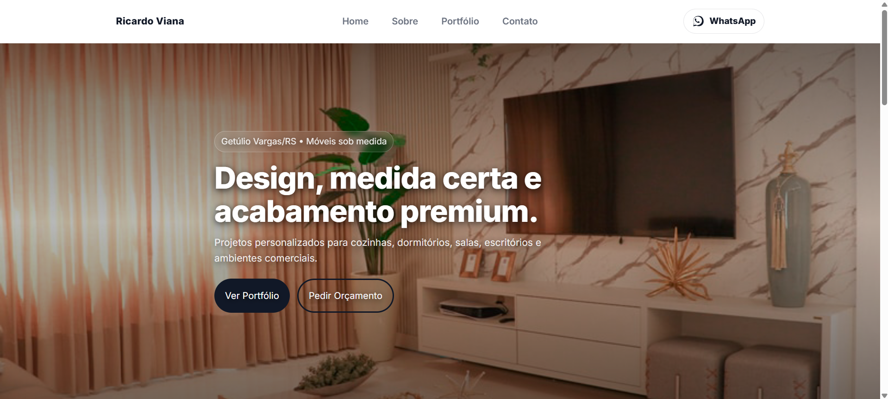

# 🪵 Ricardo Viana | Móveis Sob Medida

## 👀 Preview do projeto
[](https://assisfilipee.github.io/Site-Cadinho/)

Site institucional desenvolvido para **Ricardo Viana – Móveis Sob Medida**, com foco em design clean, navegação intuitiva e conversão de contatos via WhatsApp.

O projeto apresenta os principais serviços, portfólio visual com galeria interativa e um formulário de contato integrado ao WhatsApp, garantindo uma experiência moderna e funcional em todos os dispositivos.

---

## 🔗 Acesse o site online
👉 https://assisfilipee.github.io/Site-Cadinho/

---

## ✨ Funcionalidades
- Layout moderno e clean
- Totalmente responsivo (mobile, tablet e desktop)
- Hero com imagens dinâmicas
- Portfólio com galeria e lightbox
- Formulário de contato integrado ao WhatsApp
- Máscara automática para telefone (padrão brasileiro)
- Navegação simples e objetiva

---

## 🛠️ Tecnologias utilizadas
- HTML5  
- CSS3 (Flexbox, Grid e Media Queries)  
- JavaScript (Vanilla)

---

## 📂 Estrutura do projeto
```bash
Site-Cadinho/
├── index.html
├── style.css
├── script.js
├── img/
│   ├── cozinha.webp
│   ├── dormitorio.webp
│   ├── sala
